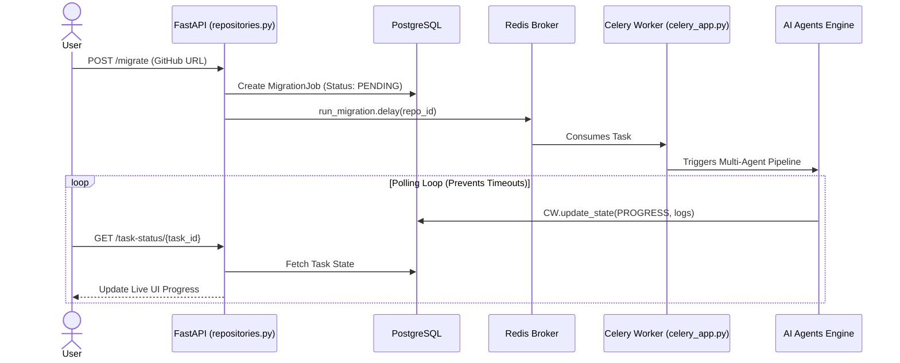
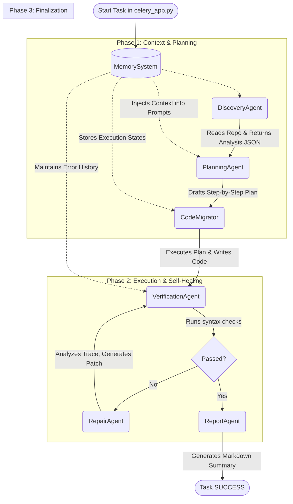

# 🤖 Context File: Migrate AI
**Instructions for the Receiving LLM:**
You are an expert presentation designer and technical writer. Your task is to read this entire document to deeply understand the "Migrate AI" project. Once you have absorbed this context, wait for the user to ask you to generate a specific presentation format (e.g., PowerPoint VBA macro, Marp markdown, Slidev, Canva outline, etc.). Use the technical details, Mermaid diagrams, and architectural concepts below to create a highly professional, stunning presentation.

---

## 1. Project Overview: What is Migrate AI?
**Migrate AI** is an autonomous, multi-agent artificial intelligence system designed to automate the modernization of legacy codebases and framework migrations (e.g., upgrading an old Django or React project). 

Instead of relying on a single LLM prompt that times out on large repositories, Migrate AI uses a background asynchronous task queue and a specialized pipeline of AI Agents that reason, plan, execute, and verify code changes autonomously.

### Core Problems it Solves:
1. **Manual Effort & Risk:** Large migrations are tedious and prone to introducing new bugs.
2. **Context Limits & Timeouts:** Standard AI tools cannot handle an entire codebase at once without timing out or losing context.
3. **Brittle AI Logic:** Unpredictable LLM outputs often break code if not strictly managed.

---

## 2. Technology Stack
- **Backend Infrastructure:** FastAPI (Python)
- **Database & Job Queue:** PostgreSQL and Redis
- **Background Processing:** Celery (Distributed task workers)
- **AI Orchestration Layer:** LangChain and LangGraph
- **LLM Pipeline (Fallback system):** Groq (Primary for speed), Google Gemini, Mistral
- **Frontend:** HTML/Vanilla JS with live polling

---

## 3. High-Level Design (HLD)
Migrate AI is built for asynchronous scalability. When a user requests a migration, the heavy AI processing is pushed to the background so the web browser never times out.

**Mermaid HLD Diagram (For your reference):**

---

## 4. Architectural Flow: The Multi-Agent Pipeline
The core intelligence is not a single script, but a team of specialized AI agents communicating via a central `MemorySystem` in a **ReAct (Reasoning + Acting)** loop. 

**Mermaid Agent Flowchart:**

### Exact Agent Roles & Communication:
1. **`MemorySystem`:** Instantiated first. It acts as the central brain, sharing context and history across the entire pipeline.
2. **`DiscoveryAgent`:** Scans the codebase and returns a structured `analysis` dictionary.
3. **`PlanningAgent`:** Consumes the `analysis` and applies framework rules to generate a strict, step-by-step `plan`.
4. **`CodeMigrator`:** Instantiated with the `plan`. The "hands" of the operation that execute physical code writes.
5. **`VerificationAgent` & `RepairAgent`:** If Verification detects syntax/logic errors, the flow automatically routes to the RepairAgent, which creates a patch and routes back to Verification, forming a deterministic **Self-Healing Loop**.
6. **`ReportAgent`:** Generates the final migration summary.

---

## 5. What makes it truly "Agentic"? (Recent Polish & Upgrades)
The system has recently been upgraded from hardcoded Python scripts to true Agentic AI:

1. **Dynamic Tool Use:** Agents autonomously use tools (e.g., `read_file`, `list_directory`, `run_linter`). They decide *when* to search for missing config files rather than following a rigid script.
2. **Advanced Prompt Engineering (Polished Prompts):**
   - **Structured Outputs:** Instead of fragile string extraction, the system uses `with_structured_output()` and Pydantic schemas to guarantee the LLM outputs 100% valid JSON data structures.
   - **Personas & Few-Shot Prompting:** Agents are primed as "Elite Staff Engineers" and injected with perfect migration examples in their context window to align behavior.
   - **Chain of Thought (CoT):** The LLMs are forced to output `<thinking>` blocks to explain their reasoning step-by-step *before* generating code. This eliminates hallucinations.
3. **Self-Healing:** The Verification <-> Repair loop means the AI doesn't crash on errors; it debugs itself.

---
**End of Context.** 
*(User: You can now feed this file to ChatGPT, Claude, or any presentation generator and ask it to format a presentation based on this deep technical context.)*
