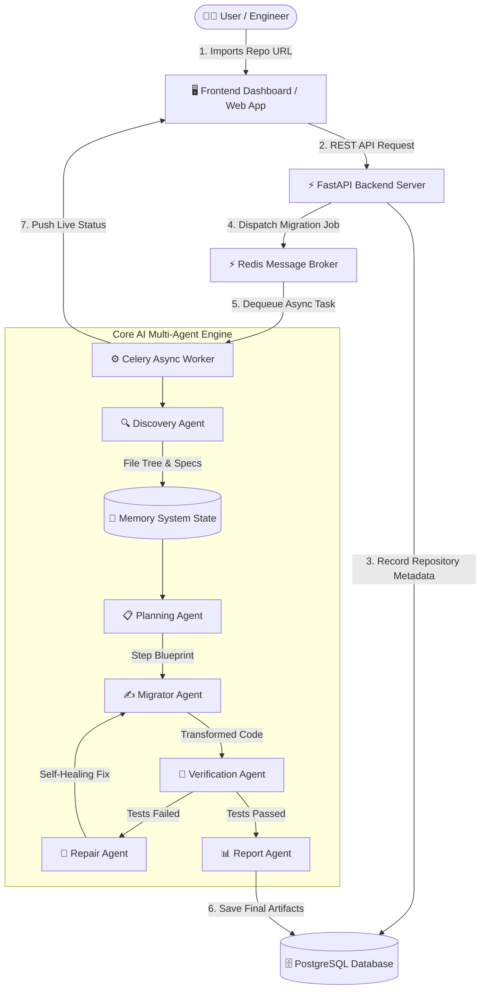
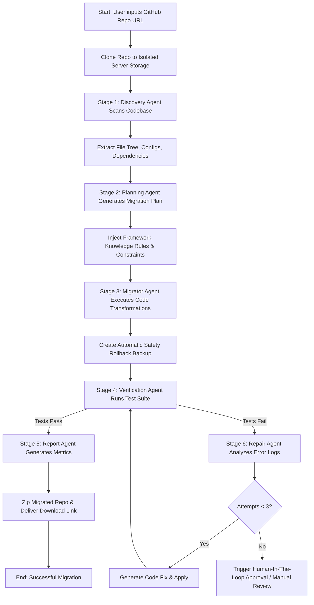

# 🚀 Migrate AI: Autonomous Codebase Migration System
## Professional Executive & Engineering Presentation Deck

---

## 📋 Table of Contents
1. **Executive Summary & The Problem**
2. **System Architecture & High-Level Design (HLD)**
3. **End-to-End Workflow Diagram (Mermaid Flowchart)**
4. **LangChain & LangGraph Orchestration Engine**
5. **Deep Dive: The 6 Autonomous AI Agents**
6. **Prompt Engineering & Context Enrichment Engine**
7. **Self-Healing Loop (Verification & Repair)**
8. **Enterprise Security, Resilience & Scalability**
9. **Live Demo & Presentation Script**

---

## 🎯 1. Executive Summary & The Problem

### The Challenge of Legacy Code Modernization
* ⏳ **Time-Intensive**: Migrating legacy frameworks (e.g. Django 2.x ➔ 5.x, React Class ➔ Hooks, Python 2 ➔ 3, Pydantic v1 ➔ v2) requires hundreds of manual developer hours.
* 🐛 **High Bug Surface**: Manual refactoring introduces subtle logic flaws, broken imports, and runtime crashes.
* 🛑 **Traditional AI Failures**: Single-prompt LLM chats time out, hallucinate dependencies, hit token limits, and cannot execute full-repo migrations cleanly.

### The Solution: Migrate AI
**Migrate AI** is a state-of-the-art **Multi-Agent Autonomous Framework** that automates the full migration lifecycle — from repository ingestion and strategic planning to code transformation, self-healing QA, and final report generation.

---

## 🏗️ 2. System Architecture & High-Level Design (HLD)

The architecture is built on a decoupled, microservices-inspired paradigm to handle long-running, multi-file code modifications asynchronously without browser or gateway timeouts.



---

## 🔄 3. End-to-End Execution Flowchart



---

## 🧠 4. LangChain & LangGraph Orchestration Engine

Our platform uses **LangChain** and **LangGraph** to govern agent state transitions, tool execution, and fallback strategies.

```
       +-------------------------------------------------------------+
       |                  LangGraph State Graph                       |
       |                                                             |
       |  [DISCOVER] ----> [PLAN] ----> [MIGRATE] ----> [VERIFY]     |
       |                                                   |         |
       |                                            (Fails)|         |
       |                                                   v         |
       |                                                [REPAIR]     |
       |                                                   |         |
       |                                                   +---------+
       +-------------------------------------------------------------+
```

### Key Technical Capabilities:
1. **Shared State Memory System**: Every agent reads from and updates a centralized `MemorySystem` object containing project metadata, dependency trees, AST maps, and step execution status.
2. **Multi-LLM Fallback Resilience**: 
   - **Primary**: Groq (`llama-3.3-70b-versatile` / `llama-3.1-8b-instant`)
   - **Fallback 1**: Google Gemini (`gemini-1.5-flash`)
   - **Fallback 2**: Mistral AI (`mistral-small-3.1`)
   - **Offline Backup**: Rule-based `FallbackLLM` ensuring zero server crashes even if APIs go down.

---

## 🤖 5. Deep Dive: The 6 Autonomous AI Agents

| Agent Name | Primary Responsibility | Input Context | Output / Output Schema |
| :--- | :--- | :--- | :--- |
| **1. 🔍 Discovery Agent** | Codebase ingestion, framework detection, dependency audit | File tree (top 200 files), key config files (`requirements.txt`, `package.json`, `main.py`) | JSON: `framework`, `version`, `confidence`, `dependencies`, `structure`, `summary` |
| **2. 📋 Planning Agent** | Strategic blueprint generation & risk estimation | Discovery findings + Framework Knowledge Base (`rules/framework_rules.json`) | JSON: `title`, `steps[]`, `breaking_changes[]`, `difficulty`, `risk_level` |
| **3. ✍️ Migrator Agent** | Code transformation & file-level modifications | Migration plan + Source code files | Transformed source files + Safety backup snapshot |
| **4. 🧪 Verification Agent** | Automated test suite execution & QA validation | Refactored repo codebase + Target test command (`pytest`, `django test`, `npm test`) | Execution metrics: `passed`, `failed`, `full_output`, `tests_generated` |
| **5. 🔧 Repair Agent** | Autonomous self-healing for failing tests (ReAct loop) | Terminal error logs + Stack traces + Failing source code | Surgical code patch + Re-verification trigger (Max 3 retries) |
| **6. 📊 Report Agent** | Summary generation & executive audit trail | Memory system history + Execution statistics | Comprehensive Markdown & JSON summary report |

---

## 💡 6. Prompt Engineering & Context Enrichment Engine

To achieve high accuracy and prevent hallucinations, all agent calls pass through a specialized **Context Enrichment Pipeline**:

```
[Raw User/Repo Request]
          │
          ▼
┌────────────────────────────────────────────────────────┐
│ Context Enrichment Step                                │
│ 1. Truncate & clean raw files (ignore node_modules/.git)│
│ 2. Inject Framework Breaking Changes Rules             │
│ 3. Enforce CoT (Chain-of-Thought) Reasoning Directives  │
│ 4. Bind Pydantic / JSON Output Schemas                 │
└────────────────────────────────────────────────────────┘
          │
          ▼
[Enriched Prompt ➔ LLM] ➔ [Strict JSON Response]
```

### Prompt Engineering Highlights:
- **Chain-of-Thought (CoT)**: Agents are instructed to explain *why* a framework or syntax change is needed before generating output.
- **Pydantic Schema Guardrails**: Outputs are strictly parsed and validated to guarantee zero malformed JSON errors.
- **Context Truncation & Token Optimization**: Reads targeted key files to keep prompt sizes compact, fast, and cost-effective.

---

## 🛡️ 7. Enterprise Security, Resilience & Scalability

1. **Async Non-Blocking Architecture**: Long migrations (taking minutes or hours) run entirely inside **Celery background workers**. The UI polls task status without keeping HTTP connections open.
2. **Safety Rollback Backups**: Before modifying any codebase, `MigratorAgent` creates a clean snapshot directory. If unrepairable errors occur, the repository instantly rolls back to safety.
3. **Multi-Tenant Authentication**: Built-in OAuth2 JWT security with PostgreSQL persistence.

---

## 🎤 8. Executive Presentation Talking Points (Slide Script)

> **Introduction**:  
> *"Good morning/afternoon everyone. Today, I'm excited to present **Migrate AI**, an autonomous multi-agent platform designed to solve one of software engineering's biggest headaches: legacy code migration."*

> **The Problem**:  
> *"Upgrading frameworks like Django, React, or FastAPI traditionally takes developers weeks of manual search-and-replace, testing, and debugging. Chatbots like ChatGPT fail here because they don't have full codebase awareness and time out on large jobs."*

> **Our Architecture**:  
> *"We solved this by building an asynchronous, agentic architecture powered by FastAPI, Celery, Redis, and LangChain/LangGraph. When a user submits a GitHub repository, our system delegates the work to 6 specialized AI agents running in the background."*

> **The Agentic Workflow**:  
> *"1. **Discovery Agent** scans the repo and identifies legacy dependencies.<br>"*  
> *"2. **Planning Agent** cross-references framework rules to generate a step-by-step migration blueprint.<br>"*  
> *"3. **Migrator Agent** refactors the code while creating automatic safety backups.<br>"*  
> *"4. **Verification & Repair Agents** form a self-healing loop: running tests, reading error logs, and fixing bugs autonomously without human intervention."*

> **Key Takeaway**:  
> *"Migrate AI transforms a 2-week manual engineering sprint into a 3-minute autonomous background job — safely, reliably, and at scale."*

---

*Presented by: Achyuth Namburi & Team*  
*Project Repository: [GitHub - Migrate AI](https://github.com/AchyuthNamburi/__MIGRATE_AI__)*
